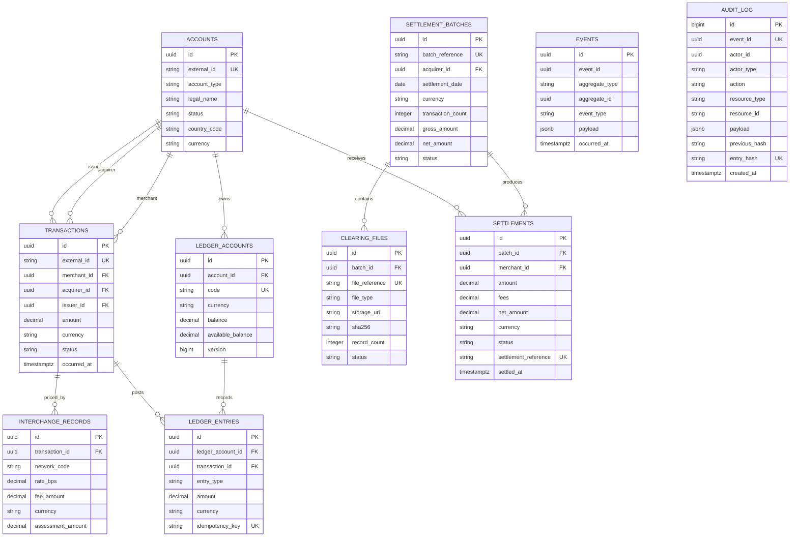

# Card Settlement Rail ERD

`events` is range-partitioned by `occurred_at`; production operations should create future monthly partitions before they are needed. `audit_log` is append-only at the application layer and cryptographically hash-chained by its database trigger.
